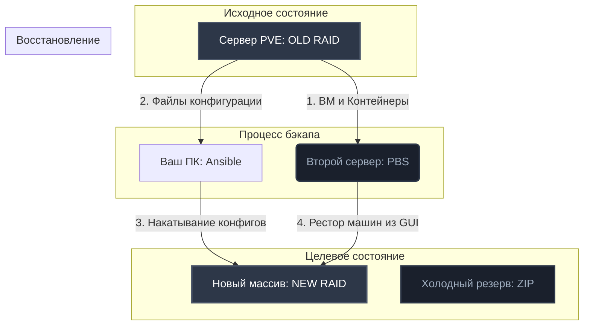

# 🛡️ Proxmox VE Disaster Recovery & Storage Migration Tool

Репозиторий содержит автоматизированные Ansible-плейбуки и пошаговый регламент для безопасной миграции основного хранилища сервера **HPE ProLiant (Gen8/Gen10)** с массива 4x SSD на отказоустойчивое «зеркало» 2x SSD (с выделением оставшихся дисков в холодный резерв ZIP).

В качестве безопасного промежуточного хранилища бэкапов используется второй сервер с развернутым **Proxmox Backup Server (PBS)**.

---

### 🏗️ Архитектура решения



---

## 🚀 Быстрый старт

### 1. Подготовка окружения
Клонируйте репозиторий и создайте локальный файл инвентаря из шаблона:
```bash
cp hosts.example.ini hosts.ini
```

Отредактируйте `hosts.ini`, указав актуальный IP-адрес вашего PVE-сервера:
```ini
[proxmox_primary]
192.168.1.100 ansible_user=root
```

### 2. Этап 1: Резервное копирование (ДО работ с железом)
Запустите плейбук создания бэкапов. Он автоматически отправит снапшоты всех ВМ на PBS, упакует конфигурацию хоста и скачает её на ваш ПК:
```bash
ansible-playbook -i hosts.ini pve_backup.yml
```

### 3. Этап 2: Модификация железа
1. Выключите сервер (`poweroff`).
2. Извлеките все 4 старых SSD.
3. Установите **2 SSD** в первые слоты (остальные 2 отложите на полку как ZIP).
4. Включите сервер, зайдите в утилиту **HPE Smart Storage Administrator (SSA)** и создайте **RAID 1 (Зеркало)**.
5. Установите чистый Proxmox VE с флешки на новый массив. 
   * *Важно:* Укажите исходный IP-адрес и Hostname!

### 4. Этап 3: Восстановление ОС и конфигурации
После того как чистый Proxmox станет доступен по SSH, запустите плейбук восстановления:
```bash
ansible-playbook -i hosts.ini pve_restore.yml
```
*Сервер автоматически примет старые настройки сети, кластера, пароли, подключит PBS и уйдет в перезагрузку.*

### 5. Этап 4: Разворачивание виртуальных машин (Вручную)
1. Откройте веб-интерфейс ожившего Proxmox VE.
2. Слева выберите хранилище `PBS` -> вкладка **Backups**.
3. Выделяйте ваши ВМ по очереди, нажимайте **Restore** и указывайте целью ваш новый локальный SSD-массив.

---

## 🛠️ Описание файлов проекта

### `pve_backup.yml`
```yaml
---
- name: Proxmox VE Disaster Recovery - Backup Phase
  hosts: proxmox_primary
  become: true
  vars:
    pbs_storage_name: "PBS" # Имя СХД PBS в интерфейсе вашего PVE
    local_download_path: "./backup_configs/"

  tasks:
    - name: 1. Запуск бэкапа всех ВМ и контейнеров на PBS
      ansible.builtin.command: "vzdump --all 1 --storage {{ pbs_storage_name }} --mode snapshot"
      register: vzdump_output
      changed_when: true

    - name: 2. Создание архива конфигурации самого Proxmox VE
      community.general.archive:
        path:
          - /etc/pve
          - /etc/network/interfaces
        dest: /root/pve-settings.tar.gz
        format: gz
        force_archive: true

    - name: 3. Скачивание архива конфигурации на ПК координатора
      ansible.builtin.fetch:
        src: /root/pve-settings.tar.gz
        dest: "{{ local_download_path }}"
        flat: true
```

### `pve_restore.yml`
```yaml
---
- name: Proxmox VE Disaster Recovery - Restore Phase
  hosts: proxmox_primary
  become: true
  vars:
    local_config_archive: "./backup_configs/pve-settings.tar.gz"

  tasks:
    - name: 1. Копирование архива конфигурации обратно на новый сервер
      ansible.builtin.copy:
        src: "{{ local_config_archive }}"
        dest: /root/pve-settings.tar.gz
        mode: '0600'

    - name: 2. Распаковка конфигурации в корень новой системы
      ansible.builtin.unarchive:
        src: /root/pve-settings.tar.gz
        dest: /
        remote_src: true

    - name: 3. Перезагрузка сервера для применения изменений
      ansible.builtin.reboot:
        reboot_timeout: 600
```

---

## 🔒 Безопасность и Git (Важно!)

Для предотвращения утечки учетных данных и IP-адресов серверов в репозитории настроены строгие правила исключений.

Файлы конфигурации `hosts.ini` и папка с локальными бэкапами сессий `backup_configs/` **находятся в `.gitignore` и никогда не попадут в веб.**

### Использование секретов (Ansible Vault)
Если вам потребуется зашифровать чувствительные переменные (например, токены авторизации), используйте команду:
```bash
ansible-vault encrypt имя_файла.yml
```
Запуск плейбуков с зашифрованными файлами выполняется с флагом запроса пароля:
```bash
ansible-playbook -i hosts.ini pve_backup.yml --ask-vault-pass
```

---

## 💡 Совет по тюнингу производительности (После восстановления)
После того как виртуалки будут развернуты на новом RAID, зайдите в настройки хранилища Proxmox и убедитесь, что включена технология **HPE Smart Path**. Для RAID-массивов без вычисления четности это снижает задержки (latency) и увеличивает скорость случайного чтения (IOPS) на 30-40%.
